# はじめに

今回は、UINavigationController と UICollectionViewController と UIViewController を使いました。主に、CollectoinView の使い方を記しました。

# 完成品

cell をタップすると、簡単な画面遷移とデータの移行をしています。

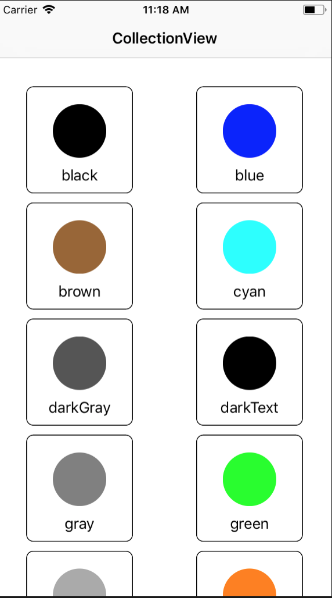
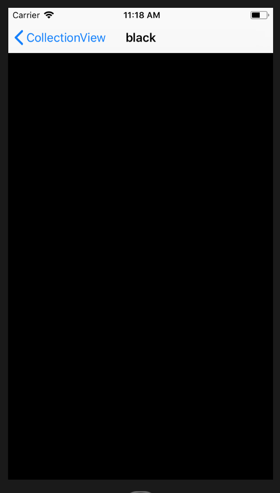

# 作ってみよう

まずは、storyboard の設定をします。
全体像としては次のようになります。
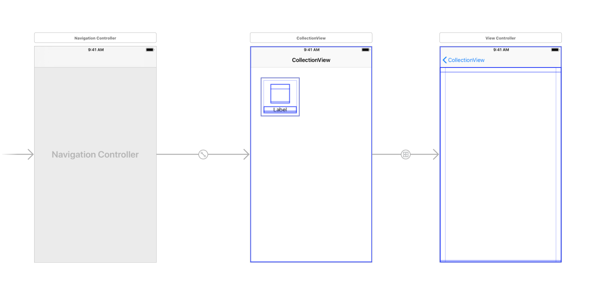

CollectionViewController の cell には Label を２つ置いています。
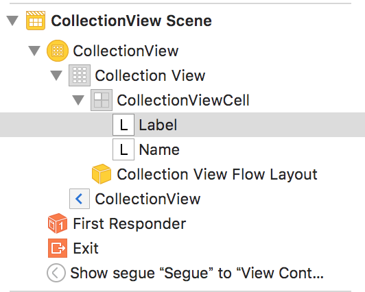

cell に配置されている色の Label を丸くしたいので、Label を選択して、次のように設定してください。
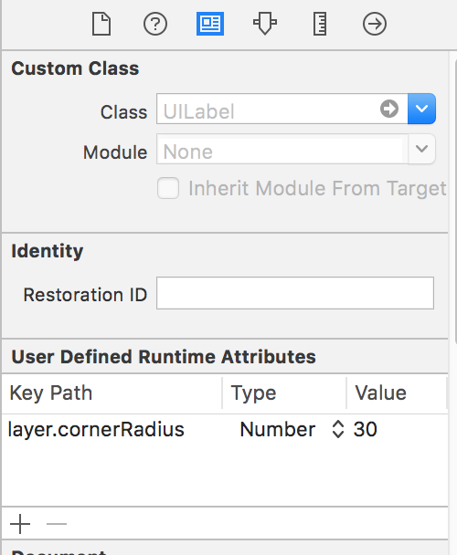

Clip To Bounds にもチェックを入れておいてください。
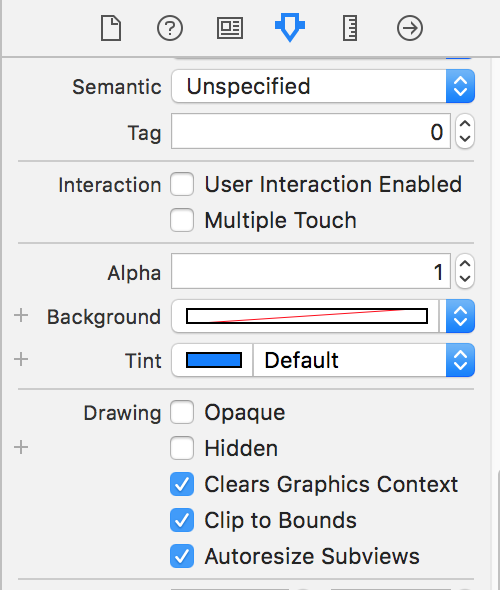

そして、一番右の ViewController の全面には Label を設置しています。


CollectionViewController から ViewController の画面遷移には Segue を使いましたが、この Segue の Identifier は"Segue"にしています。
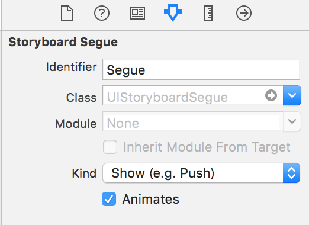

また、Cell の Identifier を"CollectionViewCell"にしています。
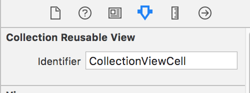

次に NewFile から、UICollectionViewController を継承している CollectionViewController.swift というファイルと UICollectionViewCell を継承している CollectionViewCell.swift というファイルを作ってください。
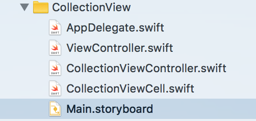

そして、storyboard の CollectionViewController と CollectionViewCell にクラスの関連付けをします。
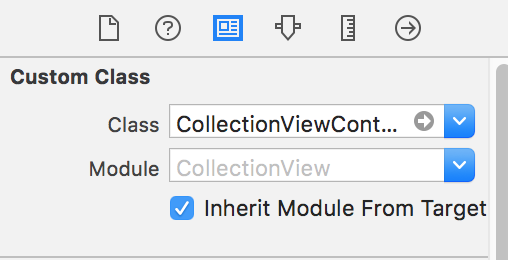

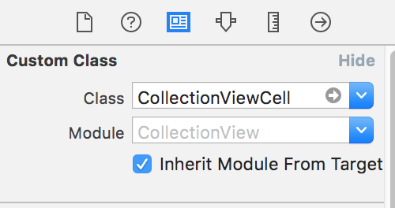

CollectionViewCell.swift の CollectionViewCell というクラスに storyboard の cell の２つのラベルを関連付けましょう。

```
//// CollectionViewCell.swift
    @IBOutlet weak var label: UILabel!
    @IBOutlet weak var name: UILabel!
```

そして、CollectionViewCell のクラス内で required init?(coder aDecoder: NSCoder)という関数を作ります。ここでは、cell の枠の色つけと丸くするコードを書きます。
CollectionViewCell.swift の全体のコードは次のようになります。

```
//// CollectionViewCell.swift
class CollectionViewCell: UICollectionViewCell {

    @IBOutlet weak var label: UILabel!
    @IBOutlet weak var name: UILabel!

    required init?(coder aDecoder: NSCoder) {
        super.init(coder: aDecoder)

        // cellの枠の太さ
        self.layer.borderWidth = 1.0
        // cellの枠の色
        self.layer.borderColor = UIColor.black.cgColor
        // cellを丸くする
        self.layer.cornerRadius = 8.0
    }
}
```

次は CollectionViewController.swift にコードを書いていきます。
説明などはコメントアウトに書きました。

```
//// CollectionViewController.swift
class CollectionViewController: UICollectionViewController {

    // cellの色の配列
    let colors: [UIColor] = [UIColor.black, UIColor.blue, UIColor.brown, UIColor.cyan, UIColor.darkGray, UIColor.darkText, UIColor.gray, UIColor.green, UIColor.lightGray, UIColor.orange, UIColor.red]
    // cellの色の名前の配列
    let colorNames: [String] = ["black", "blue", "brown", "cyan", "darkGray", "darkText", "gray", "green", "lightGray", "orange", "red"]

    // 画面遷移先に渡す色
    var giveColor: UIColor = UIColor.black
    // 画面遷移先に渡す色の名前
    var giveColorName: String = "black"

    override func viewDidLoad() {
        super.viewDidLoad()
    }

    // cellの数を返す関数
    override func collectionView(_ collectionView: UICollectionView, numberOfItemsInSection section: Int) -> Int {
        return colors.count
    }

    // cellに情報を入れていく関数
    override func collectionView(_ collectionView: UICollectionView, cellForItemAt indexPath: IndexPath) -> UICollectionViewCell {
        // Identifierが"CollectionViewCell"でCollectionViewCellというクラスのcellを取得
        let cell = collectionView.dequeueReusableCell(withReuseIdentifier: "CollectionViewCell", for: indexPath) as! CollectionViewCell

        // cellのlabelに色付け
        cell.label.backgroundColor = colors[indexPath.item]
        // cellのnameに色の名前を入れる
        cell.name.text = colorNames[indexPath.item]

        return cell
    }

    // cell選択時に呼ばれる関数
    // 画面遷移先に渡すデータをここで格納する
    override func collectionView(_ collectionView: UICollectionView, didSelectItemAt indexPath: IndexPath) {
        giveColor = colors[indexPath.item]
        giveColorName = colorNames[indexPath.item]
        // Identifierが"Segue"のSegueを使って画面遷移する関数
        performSegue(withIdentifier: "Segue", sender: nil)
    }

    // 画面遷移先のViewControllerを取得し、データを渡す
    override func prepare(for segue: UIStoryboardSegue, sender: Any?) {
        if segue.identifier == "Segue" {
            let vc = segue.destination as! ViewController
            vc.receiveColor = giveColor
            vc.receiveColorName = giveColorName
        }
    }
}
```

ViewController.swift のコードは次のようになります。

```
//// ViewController.swift
class ViewController: UIViewController {

    @IBOutlet weak var backgroundLabel: UILabel!

    // CollectionViewControllerから渡される色のデータ
    var receiveColor: UIColor = UIColor.black
    var receiveColorName: String = "black"

    override func viewDidLoad() {
        super.viewDidLoad()
        // 背景の色を渡された色にする
        backgroundLabel.backgroundColor = receiveColor
        // NavigationItemと呼ばれる一番上のバーに色の名前を入れる
        self.navigationItem.title = receiveColorName
    }
}
```

これで完成になります。

#最後に
このコードは、[github](https://github.com/azuma317/CollectionViewSample)にあげておきます。
