# はじめに
UITableViewのsectionとcellの使い方をまとめました！

# 完成品
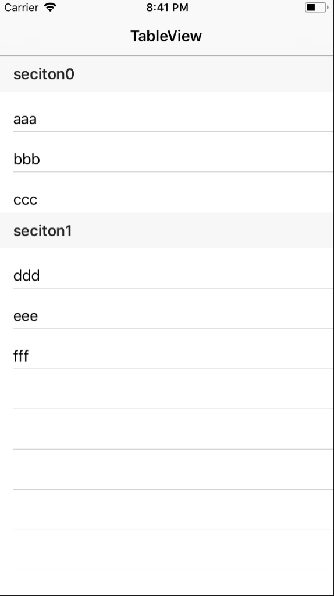

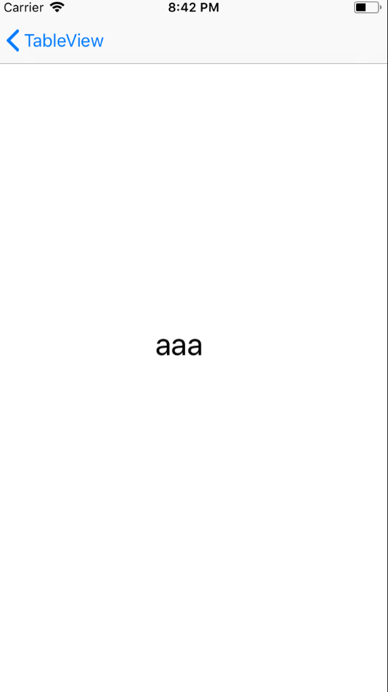


# つくってみよう
今回は、UINavigationControllerとUITableViewControllerとUIViewControllerを使いました。

まず、StoryboardでNavigationControllerを持ってきます。
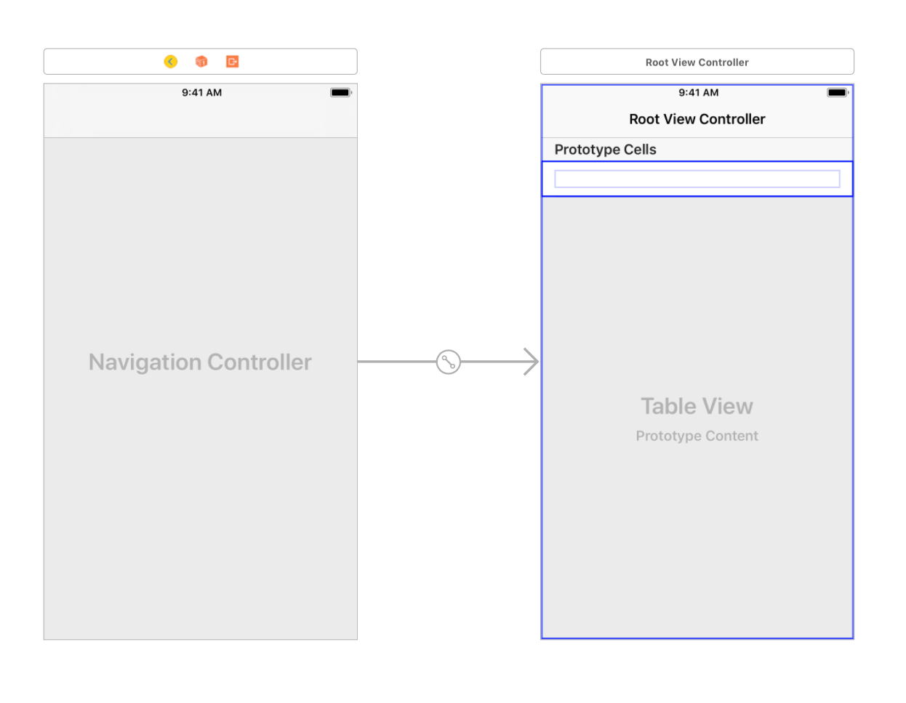

右のTableViewの上にあるRoot View ControllerをTableViewControllerに変えます。
そして、cellの中にLabelを配置します。
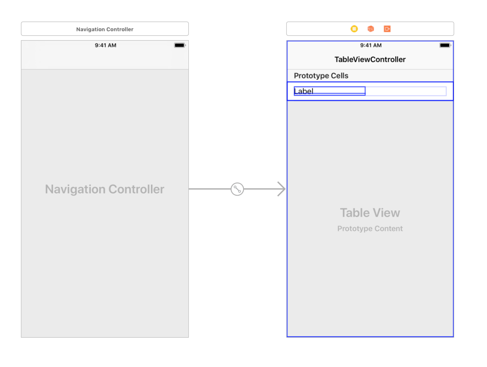

そして、Cellを選択して、CellのIdentifierをTableViewCellにします。
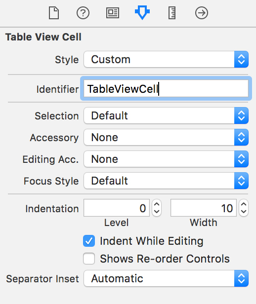

次に、StoryboardにViewControllerを持ってきます。
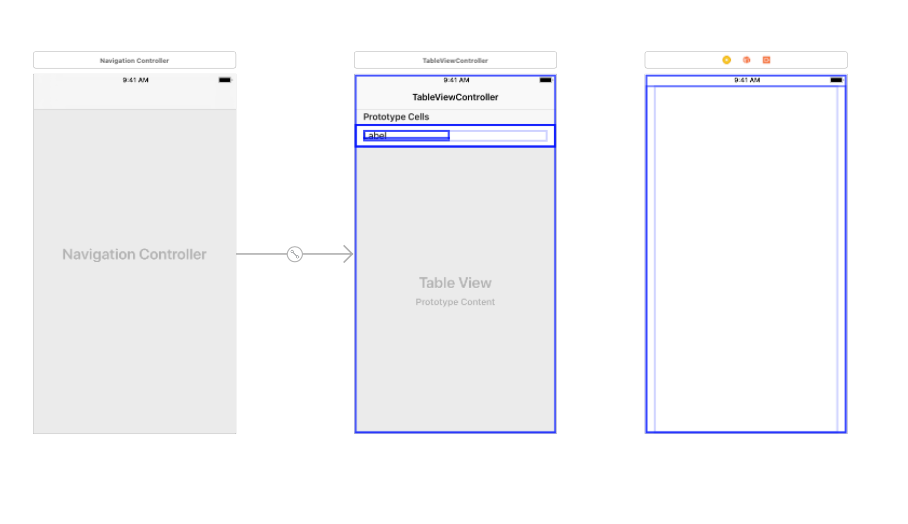

TableViewの上にある黄色いボタンをcontrolボタンを押しながらViewControllerに持っていきます。
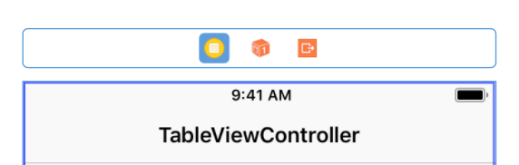

すると、こういったものが出るので、Showを押してください。
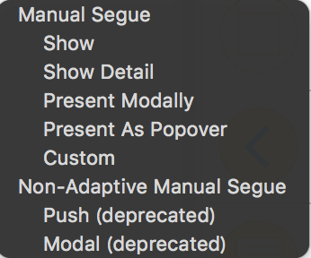

全体は、下の写真のようになります。
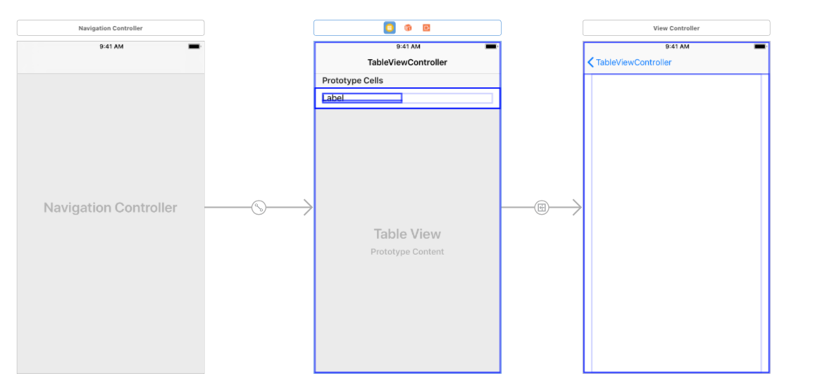

そして、TableViewControllerとViewControllerを繋いているSegueと言うものを押して、IdentifierをSegueにしてください。
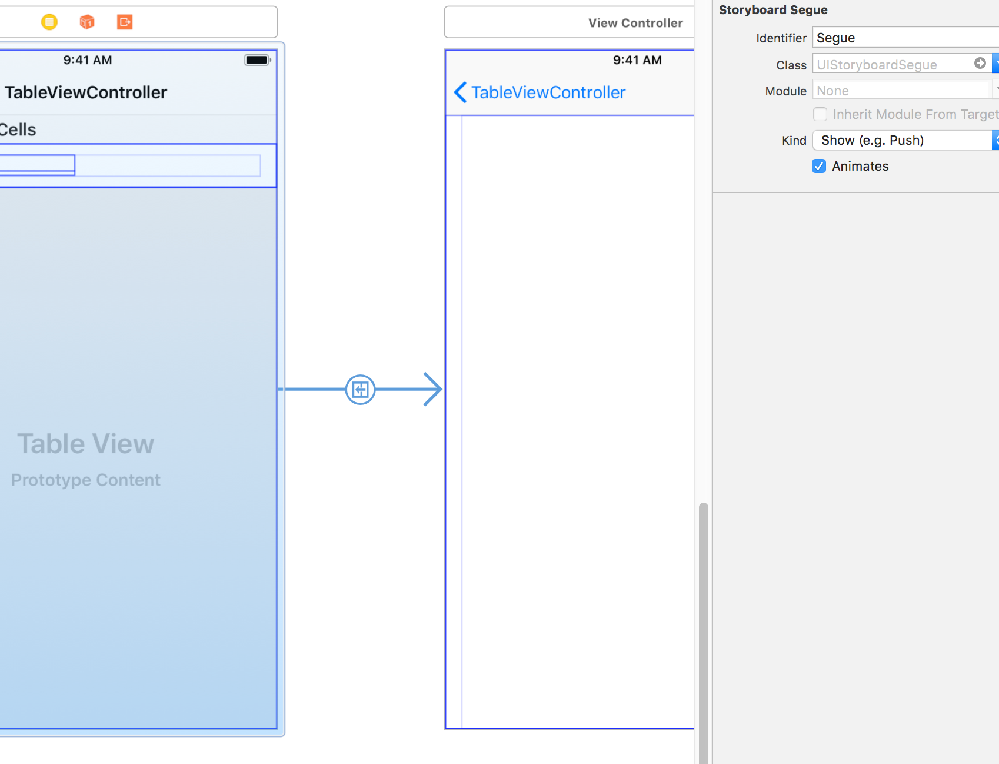

これでStroyboardはほぼ完成です。

次に、NewFile...からUITableViewControllerを継承をしているTableViewController.swiftとUITableViewCellを継承しているTableViewCell.swiftとUIViewControllerを継承しているViewController.swiftを作ってください。

Fileを継承させるには、Cocoa Touch ClassのSubclass ofに継承させたいクラスを書きます。
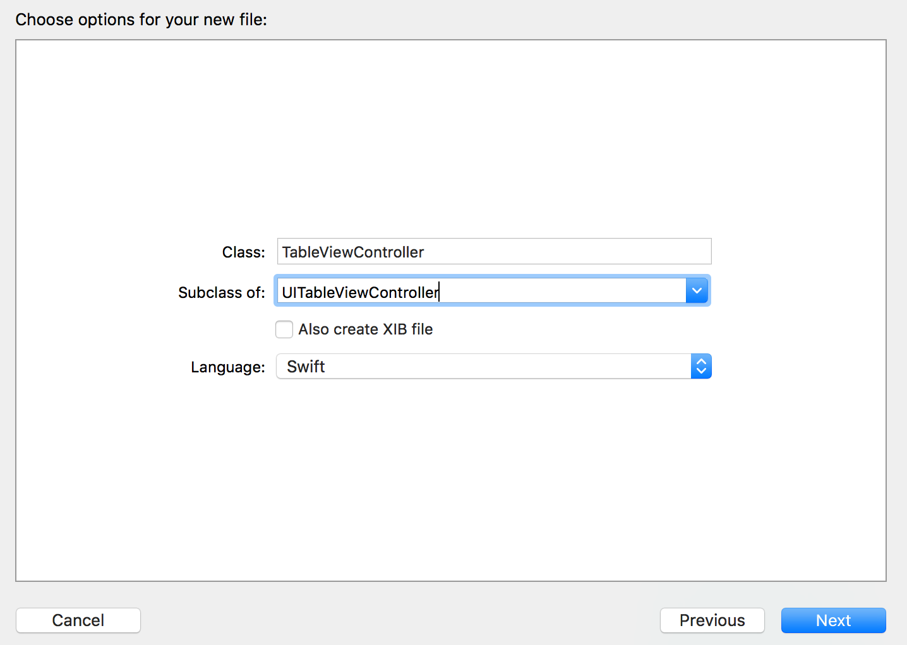

作ったファイルは左側のファイル一覧に並びます。

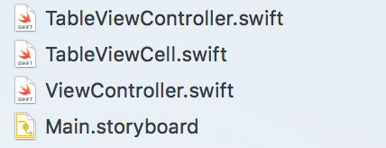

そして、StoryboardのTableViewControllerとCellとViewControllerにそれぞれのファイルを紐付けます。


そして、CellのLabelをTableViewCell.swiftに紐付けたいので、TableViewCell.swiftとStryboardを開いて、controlを押しながら、ファイルの方に持ってきます。
Labelの名前は、nameにしてあります。

```TableViewCell.swift
    @IBOutlet weak var name: UILabel!
```

そして、StoryboardのViewControllerにもLabelを置きたいので、LabelをViewControllerの真ん中に置きます。
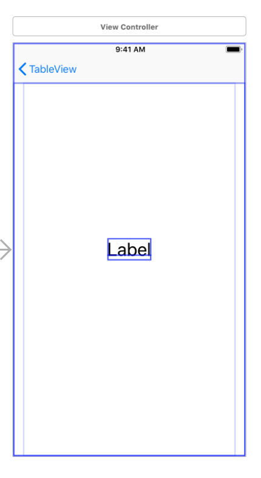

CellのLabelと同じように、StoryboardのViewControllerのLabelをViewControllerにlabelという名前で紐付けます。

```
//// ViewController.swift
    @IBOutlet weak var label: UILabel!
```

ここから、コードを書いていきます。
主に書くのは、TableViewController.swiftです。

```
//// TableViewController.swift
class TableViewController: UITableViewController {
    
    // cellのlabelに書く文字列
    let name1: [String] = ["aaa", "bbb", "ccc"]
    let name2: [String] = ["ddd", "eee", "fff"]
    
    // 遷移先のViewControllerに渡す変数
    var giveData: String = ""

    override func viewDidLoad() {
        super.viewDidLoad()
    }

    // sectionの数を返す関数
    override func numberOfSections(in tableView: UITableView) -> Int {
        return 2
    }

    // sectionごとのcellの数を返す関数
    override func tableView(_ tableView: UITableView, numberOfRowsInSection section: Int) -> Int {
        if section == 0 {
            return name1.count
        } else if section == 1 {
            return name2.count
        } else {
            return 0
        }
    }
    
    // sectionの高さを返す関数
    override func tableView(_ tableView: UITableView, heightForHeaderInSection section: Int) -> CGFloat {
        return 40
    }
    
    // sectionに載せる文字列を返す関数
    override func tableView(_ tableView: UITableView, titleForHeaderInSection section: Int) -> String? {
        return "seciton\(section)"
    }

    // cellの情報を書き込む関数
    override func tableView(_ tableView: UITableView, cellForRowAt indexPath: IndexPath) -> UITableViewCell {
        let cell = tableView.dequeueReusableCell(withIdentifier: "TableViewCell", for: indexPath) as! TableViewCell
        
        // ここでcellのlabelに値を入れています。
        if indexPath.section == 0 {
            cell.name.text = name1[indexPath.item]
        } else {
            cell.name.text = name2[indexPath.item]
        }

        return cell
    }
    
    // cellが押されたときに呼ばれる関数
    // 画面遷移の処理もここで書いている
    override func tableView(_ tableView: UITableView, didSelectRowAt indexPath: IndexPath) {
        // 押されたときのcellのlabelの文字列をViewControllerに渡したいので、一旦、giveDataに入れとく
        if indexPath.section == 0 {
            giveData = name1[indexPath.item]
        } else {
            giveData = name2[indexPath.item]
        }
        // Segueを使った画面遷移を行う関数
        performSegue(withIdentifier: "Segue", sender: nil)
    }
    
    // 遷移先のViewControllerにデータを渡す関数
    override func prepare(for segue: UIStoryboardSegue, sender: Any?) {
        if segue.identifier == "Segue" {
            let vc = segue.destination as! ViewController
            vc.receiveData = giveData
        }
    }

}
```

ViewController.swiftでの処理は、TableViewControllerから渡されたデータをlabelに反映させるだけです。

```
//// ViewController.swift
class ViewController: UIViewController {

    @IBOutlet weak var label: UILabel!
    var receiveData: String = ""
    
    override func viewDidLoad() {
        super.viewDidLoad()
        
        label.text = receiveData
    }

}
```

TableViewCell.swiftのほうはなにも書かなくて大丈夫です。

```
//// TableViewCell.swift
class TableViewCell: UITableViewCell {

    @IBOutlet weak var name: UILabel!

}
```


これで完成です。

# 最後に
[github](https://github.com/azuma317/TableViewSample)に載せました。
参考にしてください。
