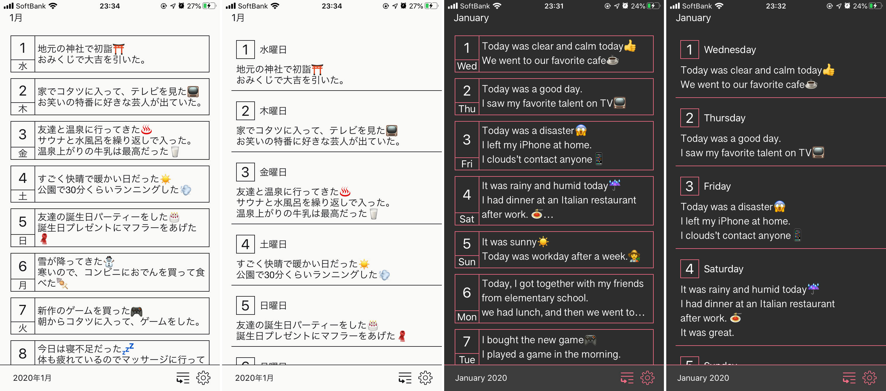

## [ReWrite](https://apps.apple.com/jp/app/id1505143601)

### 概要

シンプルな日記アプリです。
日記の自動保存やロック機能, テーマ変更やフォント変更を行うことができます.

### プレビュー

### 使用ライブラリ

- FirebaseAuth: ログインや会員登録に使用しています.
- FirebaseFirestore: 日記のデータやユーザー情報を保存しています.
- FirebaseStorage: 日記の画像を保存するのに使用しています.
- LicensePlist: ライセンスの記載に使用しています.
- SwiftDate: 日付関連のデータを扱うのに使用しています.
- SwiftTheme: アプリ内のテーマを変更する際に使用しています.
- RxSwift: UI イベントの受け取り等に使用しています.
- RxGesture: UI イベント周りで使用しています.
- RxDataSources: 日記一覧等の CollectionView に使用しています.

### 追加予定の機能

- テーマの種類追加
- フォントの種類追加
- バグ修正
- 文章内の記号追加（箇条書きや太文字等）

## [Log](https://apps.apple.com/jp/app/id1469767260)

### 概要

バレットジャーナルというタスク管理手法を利用したアプリです.
タスクの種別を 4 種類（Priority, Task, Event, Memo）に細分化して管理します.

### プレビュー

### 使用ライブラリ

- Realm:タスクの保存に使用しています.
- SwiftDate: タスクの日付管理に使用しています.
- ReSwift: Redux に使用しています.
- RxSwift: UI イベントの受け取り等に使用しています.
- RxRealm: Realm を Rx の記述で書くために使用しています.
- RxGesture: UI イベント周りで使用しています.
- RxDataSources:タスク一覧画面で使用しています.

### 追加予定の機能

- デザインの変更
- バグ修正
- Google カレンダー連携
- バックアップ機能
