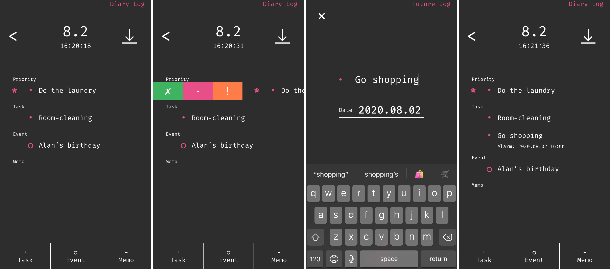

2019 年に福岡の大学を卒業後, インフラエンジニアとして新卒入社.
業務では, AWS によるサービス保守やミドルウェア（ Apache, Tomcat, Docker, Jenkins 等）の管理を行っています.
また, 趣味で Swift を使って, iOS アプリを開発しています.

## 個人開発

### [ReWrite](https://apps.apple.com/jp/app/id1505143601)

Firebase(Firestore, Storage, Hosting) を使った日記アプリです.
このアプリでは, 日記の自動保存やロック機能, テーマ適用, フォント適用などを行うことができます.

### [Log](https://apps.apple.com/jp/app/id1469767260)

バレットジャーナルというタスク管理手法を利用したアプリです.
タスクの種別を 4 種類（Priority, Task, Event, Memo）に細分化して管理します.

## インフラ業務

### AWS

- Terrafrom による Kinesis, Lambda 等の作成
- Cloud Watch Logs, Kinesis, Lambda, S3 を使用したログ基盤構築
- Viewable Impression の開発
- Datadog を使用した EC2 インスタンスの管理

### Apache, Tomcat

- Apache, Tomcat の設定やバージョンアップ
- Tomcat の出力ログのカスタマイズ
- Logrotate によるログファイルの永続化

### Docker

- Docker による開発環境構築の設定やバージョン管理
- docker-sync, mutagen による Docker 高速化検証

### Jenkins

- Groovy を使用したインフラファイルの自動デプロイ作成
